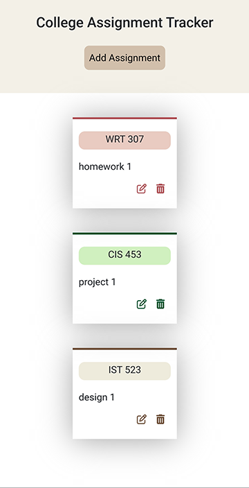
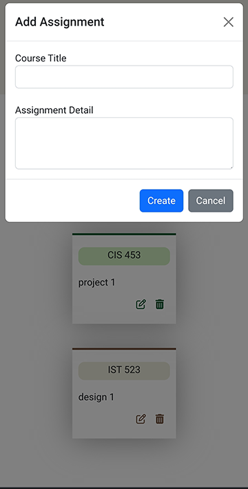

# Student Assignment Tracker

## Description

I always wanted to create an assignment tracker based on my preferences, so I built this web app with the CRUD operations (Create, Read, Update, Delete). The app works fine, but the layout and functionality can be further improved.

## Live Demo
https://worktrack.netlify.app/




## Installation
You'll need [Git](https://git-scm.com) and [Node.js](https://nodejs.org/en/download/) (which comes with [npm](http://npmjs.com)) installed on your computer. From your command line:

```bash
# Clone this repository
$ git clone https://github.com/cchenze/assignment_tracker.git

# Go into the repository
$ cd assignment_tracker

# Install dependencies
$ npm install

# Run the app
$ npm start
```
